# Setup Multiple Static Websites on a Single Server Using Nginx Virtual Hosts

This project is about a single server (**host**) using Nginx virtual host configuration for multiple websites.

**Dynamics:**

1.	Visit EC2 on AWS, launch instance. Put a name under name and tag and Pick Ubuntu OS under quick start.

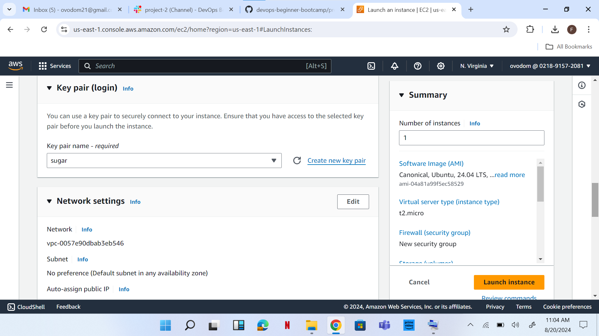
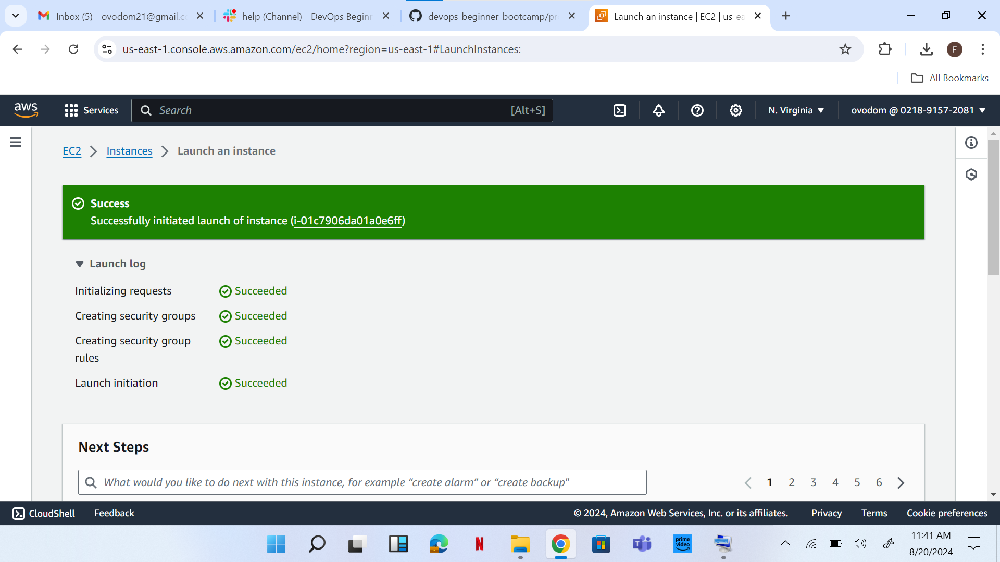

2.	After launch instance, connect to instance and copy SSH client, ssh -i "sugar.pem" ubuntu@ec2-3-215-122-7.compute-1.amazonaws.com.

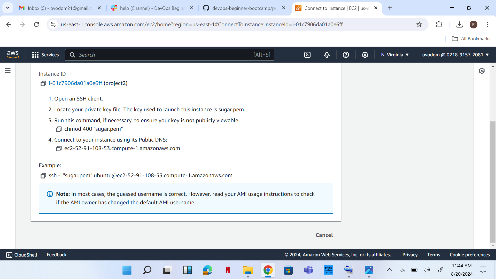 
3.	Open a terminal in the directory where I have my .pem file (**sugar.pem**)
is downloaded, paste command copied from SSH client.

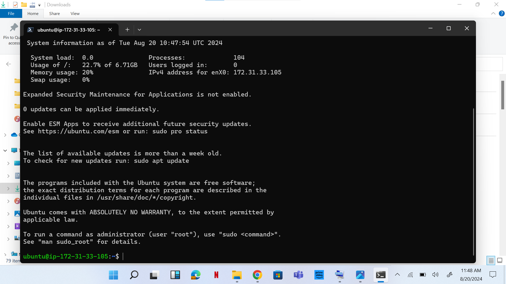
4.	Go to EC2, click on elastic IP, and get elastic IP, 3.215.122.7. Click on associate IP address to associate it.

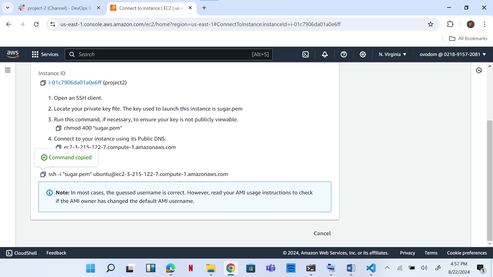
5.	Copy SSH client and paste on terminal in the directory my .pem file is.
6.	To insatall Nginx and set my websites. I executed the following commands  sudo apt on 
       sudo apt upgrade         sudo apt install nginx
7.	Start Nginx by running the  sudo systemctl start nginx  command, sudo systemctl enable nginx. This is to enable it to start on boot, 
and then I confirmed if it is running using sudo systemctl status nginx  command.

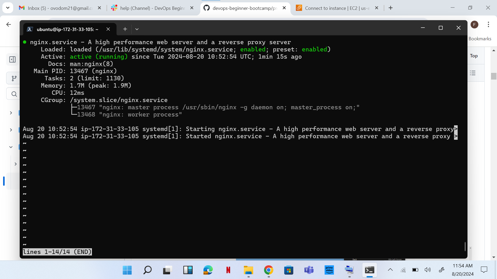
8.	Pasted my IP address on the web browser it showed welcome to Nginx [Default Nginx start up page].

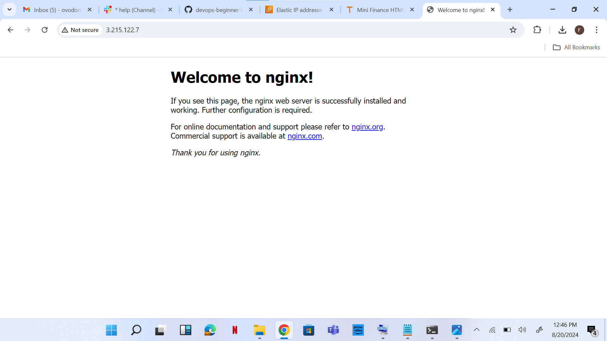
9.	Downloaded website template from tooplate.com. 
10.	Copy link address.

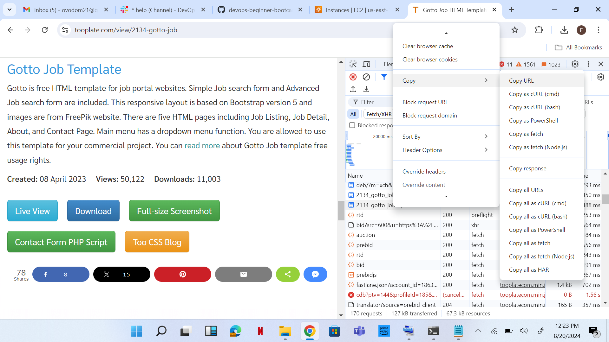

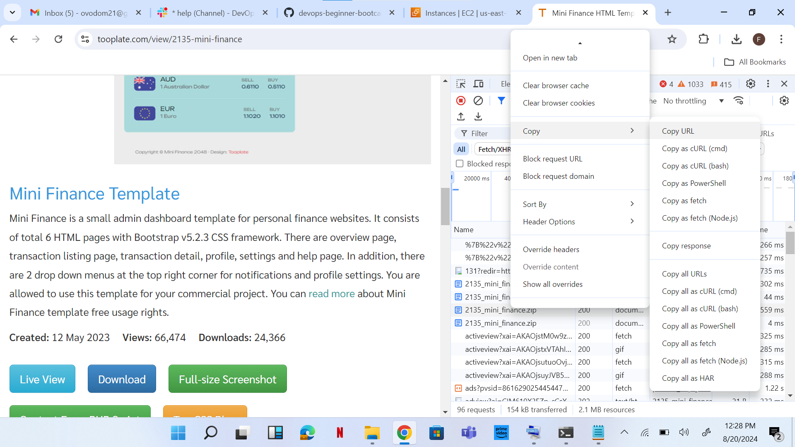
11.	To install the unzip tool, run the following command: sudo apt install unzip
12.	Execute the command to download and unzip your website files sudo curl -o /var/www/html/2098_health.zip https://www.tooplate.com/zip-templates/2134_gotto_job.zip && sudo unzip -d /var/www/html/ /var/www/html/2134_gotto_job.zip && sudo rm -f /var/www/html/2134_gotto_job.zip
13.The second website was also downloaded sudo curl -o /var/www/html/2135_mini_finance.zip https://www.tooplate.com/zip-    templates/2132_clean_work.zip && sudo unzip -d /var/www/html/ /var/www/html/2135_mini_finance.zip && sudo rm -f /var/www/html/2135_mini_finance.zip.

14.To set up website configuration in a new file in Nginx sites-avaialable directory. The following command was used sudo nano /etc/nginx/sites-available/job

15. server {
    listen 80;
    server_name example.com www.example.com;

    root /var/www/html/example.com;
    index index.html;

    location / {
        try_files $uri $uri/ =404;
    }
}
16. Root directory changed to “root/var/www/html/2137_gotto_job”

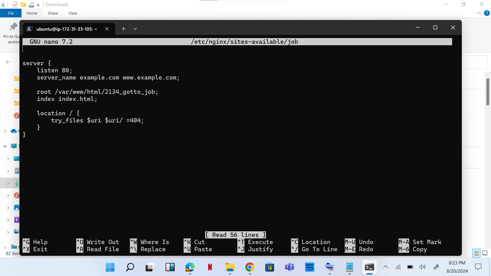
17. The second website configuration was set up in a new file Nginx sites-available directory with following command sudo nano /etc/nginx/sites-available/finance.
18. server {
    listen 80;
    server_name placeholder.com www.placeholder.com;

    root /var/www/html/placeholder.com;
    index index.html;

    location / {
        try_files $uri $uri/ =404;
    }
}
19. Root directory changed to “root/var/www/html/2135_mini_finance”

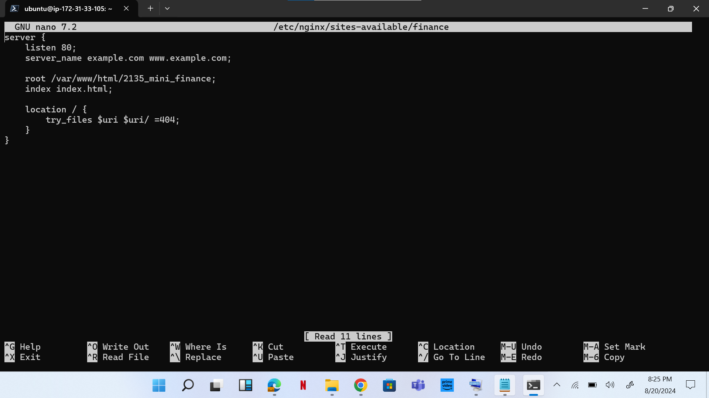
20. I created a symbolic link by running the following command  sudo ln -s /etc/nginx/sites-available/job /etc/nginx/sites-enabled/
    sudo ln -s /etc/nginx/sites-available/finance /etc/nginx/sites-enabled/
21.Run the sudo nginx –t  command.
22. Delete the default files in the sites-available and sites-enabled directories by executing the following commands:
         sudo rm /etc/nginx/sites-available/default
   sudo rm /etc/nginx/sites-enabled/default

23. Restart the Nginx server by executing the following command: sudo systemctl restart nginx
24.create an A record in route 53, select domain name and click create record.

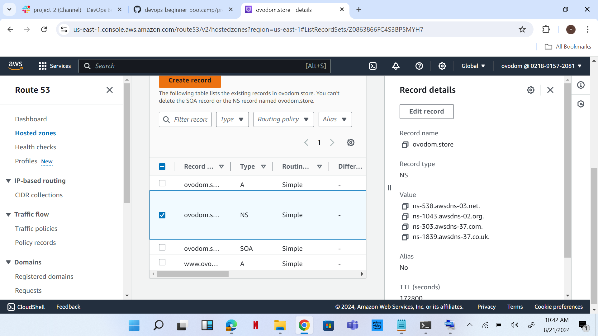
25. pasted IP address 3.215.122.7 and created record 2.
26.clicked on create record, inputed name: job and pasted my IP address.
27.clicked on create record 3, inputed name:finance and pasted my IP address.
28. I have to run the following command on terminal sudo nano /etc/nginx/sites-available/job.
   I entered the name of my domain (server_name job.ovodom.store www.job.ovodom.store;) and saved.
29. The same process was done for website 2. Domain name, server_name finance.ovodom.store www.finance.ovodom.store; edited and saved.

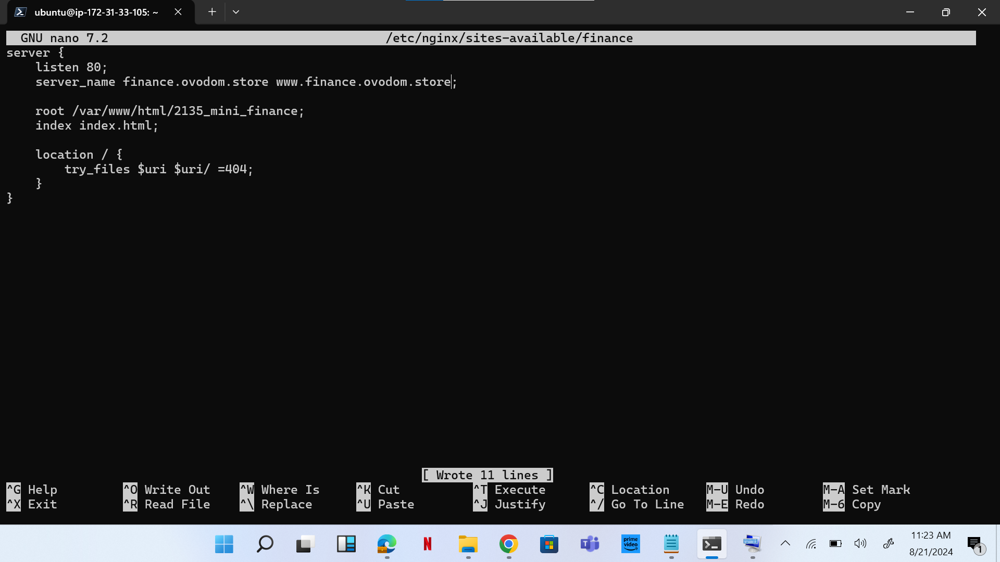
30. Restart your nginx server by running the sudo systemctl restart nginx command
31. I visited my domain in a web browser and it was accessible.

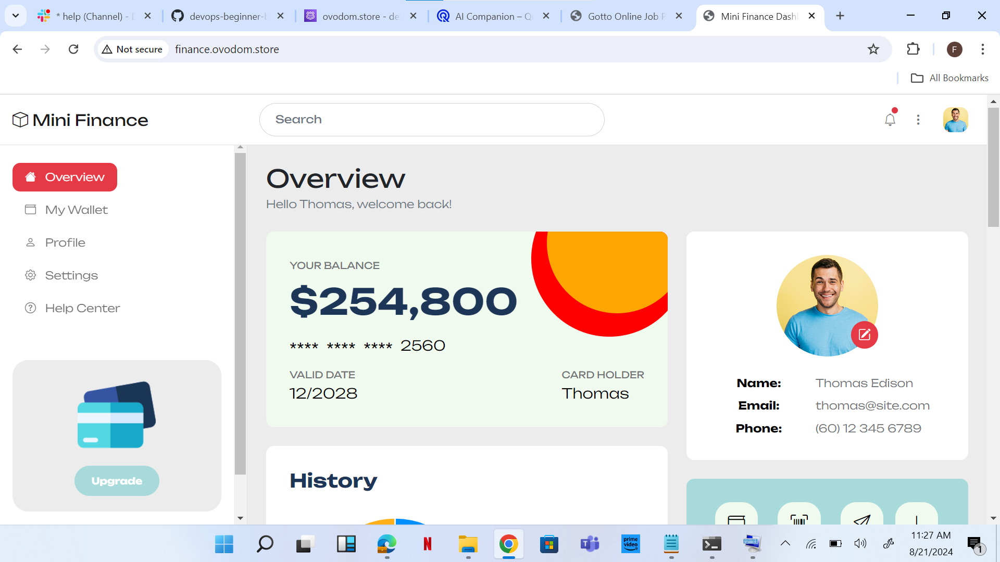
32. I ran the following commands   sudo apt update     sudo apt install python3-certbot-nginx sudo certbot –nginx. 
   This is to install Install    certbot and Request for an SSL/TLS Certificate.

33. Execute the command sudo certbot –nginx to request certificate

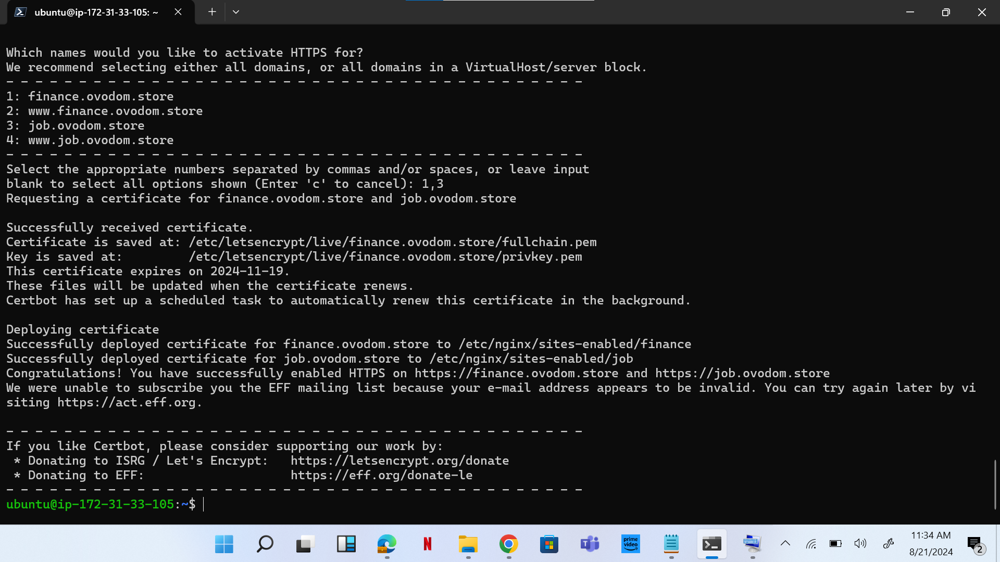

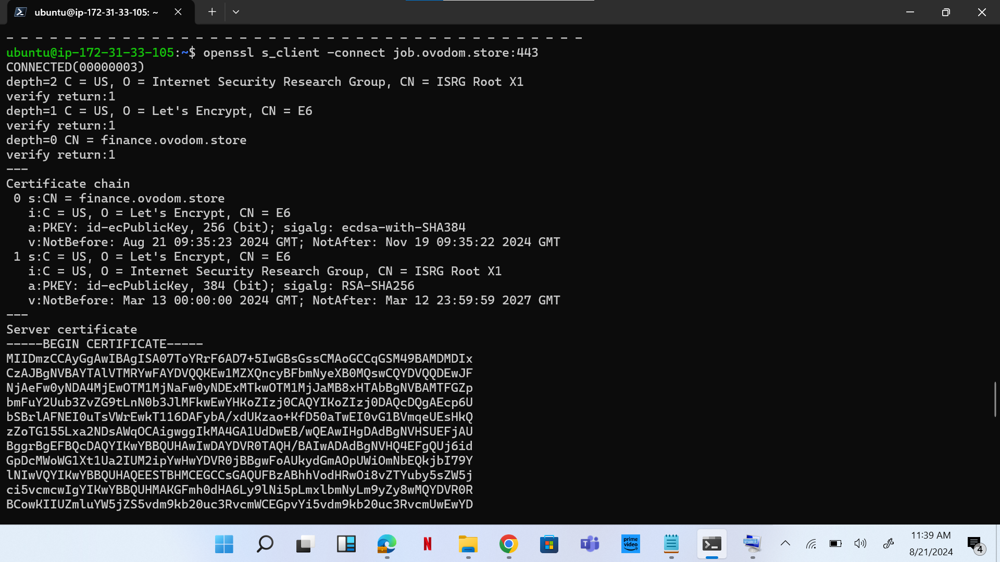
34. Verify the website's SSL using the OpenSSL utility with the command: openssl s_client -connect cleaning.cloudghoul.online:443
35. Visit https://job.ovodom.store and https://finance.ovodom.store

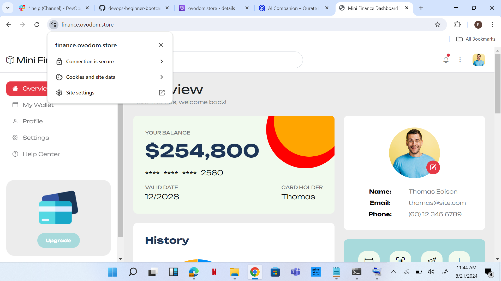

